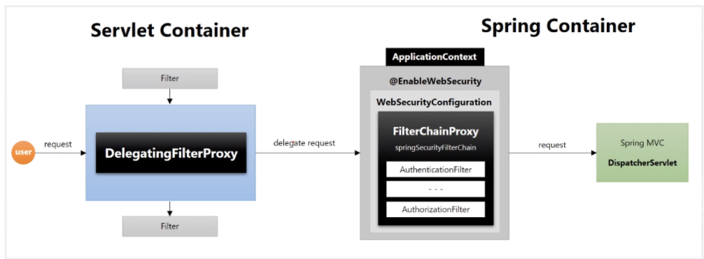

# 스프링 시큐리티 전반적인 구조
## 서플릿 필터
우선, 스프링 시큐리티는 `서블릿 필터 기반`으로 동작한다.

```
필터란, 위 그림 처럼 어플리케이션으로의 요청과 응답을 가로채 부가적인 작업을 진행한다.
이런 필터들이 엮여서 하나의 체인을 구성한다.

참고) 위 그림에서 Serlvet은 Dispatcher Servlet을 의미한다.
```
위 그림과 같이 필터 체인은 자기 아래에 연결되어 있는 필터 또는 어플리케이션으로 이어져있기 때문에 `순서가 중요`하다.

## DelegatingFilterProxy
DelegatingFilterProxy란, `서블릿 필터`이다.</br>
서블릿 컨테이너에 필터를 등록할 수 있지만, 아래 그림처럼 `스프링 빈으로 등록할 수 없다.`</br>

따라서, 스프링이 관리하는 필터를 만들어 서블릿 필터 체인과 같은 메카니즘으로 빈을 등록하여 필터들을 구성한다.</br>
이를 통해 손쉽게 필터들을 빈으로 등록하여 관리할 수 있는 장점이 존재한다.</br>
**즉, DelegatingFilterProxy는 서블릿 컨테이너와 스프링 IOC 컨테이너를 연결해주는 연결자 역할을 한다.**


### DelegatingFilterProxy 장점
필터들을 스프링 빈으로 등록하여 사용할 때, 얻을 수 있는 장점은 여러 가지 있다.</br>
그 중 하나는 보통 서블릿 컨테이너는 모든 필터들이 등록된 후에 실행되지만,</br> 빈으로 등록된 필터들은 필요할 때 로딩한다.  이를 통해 `초기 어플리케이션 시작 시간 단축`이 가능하다.
